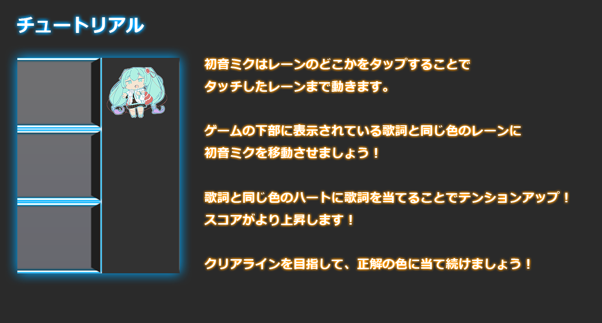

# 『Voice Shooting』
## Voice Shootingについて
### 概要
Voice Shootingはレーンの色と歌詞の色が一致するようにステージ上のライブアーティスト(ミク、ルカ)を移動させて観客に歌詞を届けてスコアを伸ばしていくゲームです。

### 遊び方の流れ
1. アプリ起動後に注意事項が出ますので確認する
1. タイトル画面から楽曲選択画面に進み、遊びたい曲を選択する
1. チュートリアル画面の中身を確認し、画面をタップする
1. 楽曲が流れるので、下部に流れる歌詞の色を確認し、発話直前の歌詞と同じ色のレーンをタップするとライブアーティストが移動する
1. ライブアーティストが発話した歌詞の色とレーンの色が同じになるようにライブアーティストを移動させてハイスコアを目指す

### 説明動画
todo 用意してYoutubeに上げたものを参照する

### アプリの特徴
- TextAliveAppAPIから取得した楽曲データを使用
  - 歌詞情報を取得して単語ごとに発話を表現
  - サビ情報を取得してライブアーティストの表情変化を実現
- ゲームエンジンであるPhaserを使用
- マルチデバイス(PC,スマートフォン)対応
- 楽曲に合わせたビジュアライザーを表示
- 採用作品6曲に対応（対応楽曲は以下で表記）

### 対応楽曲
- First Note
- 嘘も本当も君だから
- その心に灯る色は
- 夏をなぞって
- 密かなる交信曲
- Freedom!

### 対応環境
こちらのアプリは以下の環境での動作が可能です。
|デバイス|対応ブラウザ|
|:--|:--|
|PC|Firefox Chrome|
|iOS|Safari|
|Android|Chrome|

### 注意事項
こちらのアプリで遊ぶ際には以下の点に注意してください。
- スマートフォンで遊ぶ場合は本体を横向きにする
- iOS環境のSafariで遊ぶ際には「設定」→「Safari」→「タブバーを表示」をオフにする

## 開発者向けドキュメント
以下のコマンドをpacakge.jsonのある階層で実行する
### パッケージのインストール
> npm install

### 開発環境の起動
> npm run dev
### 開発環境の起動( visualizerのキャッシュ更新をスキップする )
> npm run dev:nocache
### 本番リリースビルド
> npm run build

### コミット前にやること
textalive-sampleディレクトリで `npm run lint:write` を実行してください。
差分があればコミットしてください。

### PRマージ前にやること
Github Actionsでlintが成功していることを確認してください。
